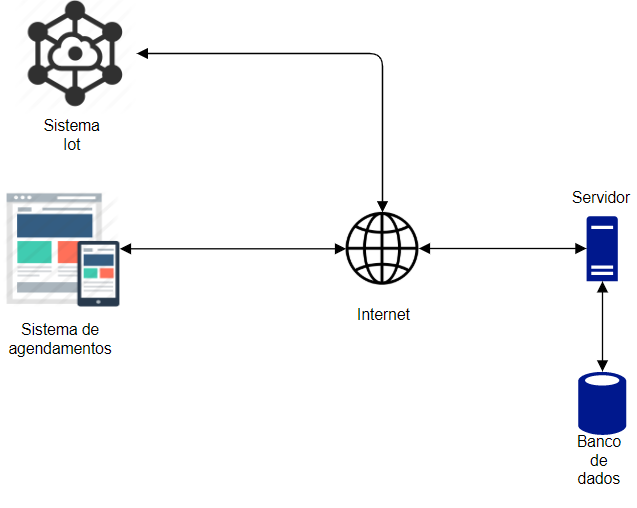

# Trabalho de conclusão de curso, atualizado.
Refatoração do modelo apresentado no trabalho de conclusão de curso.

## Diagrama do sistema proposto.


## Configurando esses aplicativos de exemplo: 
```bash
var firebaseConfig = {
  apiKey: "API_KEY",
  authDomain: "PROJECT_ID.firebaseapp.com",
  databaseURL: "https://PROJECT_ID.firebaseio.com",
  projectId: "PROJECT_ID",
  storageBucket: "PROJECT_ID.appspot.com",
  messagingSenderId: "SENDER_ID",
  appId: "APP_ID",
  measurementId: "G-MEASUREMENT_ID",
};
```
[Link](https://firebase.google.com/docs/web/setup#default-hosting-site) oficial do firebase contendo os passos a serem seguidos para configura seu projeto.

Detro da pasta tanto front-end e back-end, possui um arquivo chamado .env.example, modelo variáveis utilizadas no projeto.


## Você pode executar esses aplicativos de exemplo: 
 Na pasta front-end ou back-end
```bash
npm install && npm start
# or
yarn && yarn start
```

## Layout base da aplicação web
Link do [figma](https://www.figma.com/file/dXeV9pfWaGDbJZrJC4ctyw/TCC-2?node-id=0%3A1).
